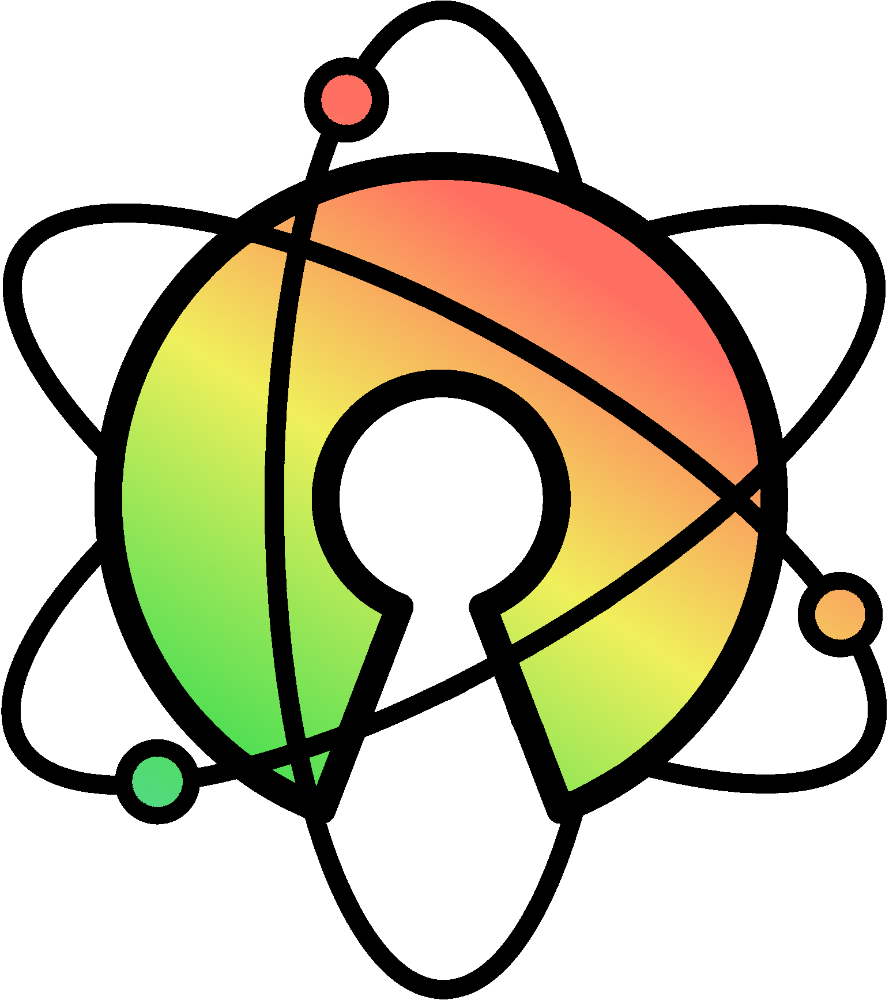

# semester-project
The winter 2023 group semester project for [Aksel Oldeide](https://github.com/AkselOldeide), [Helene Flått](https://github.com/Helflaa) and [Panida Paethanom](https://github.com/Panida287) :snowman: :snowflake: :christmas_tree:

Latest functioning website build running [here](www.infernal-triad.netlify.app)

## Paths and assets:

### External tools and software:
 
:rainbow: Gradient for the background on the "exhibitions"-page was generated using: [CSS Gradient](https://cssgradient.io)

    
:movie_camera: Animations and videos used on our page are from [Freepik](https://www.freepik.com)

 
:framed_picture: Illustration images created with AI image generators:
[Midjourney](https://www.midjourney.com/home) and [Bing Ai](https://www.bing.com/create).
