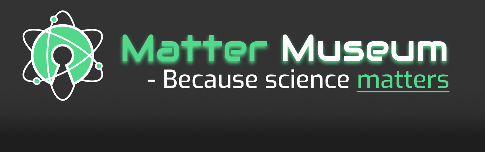

# semester-project
The winter 2023 group semester project for [Aksel Oldeide](https://github.com/AkselOldeide), [Helene Flått](https://github.com/Helflaa) and [Panida Paethanom](https://github.com/Panida287) ⛄ ❄️ 🎄

Latest functioning website build running [here](https://infernal-triad.netlify.app)

## Paths and assets:

### External tools and software:
 
🌈 Gradient for the background on the "exhibitions"-page was generated using: [CSS Gradient](https://cssgradient.io)

🎨 We designed our page at [Figma design](https://www.figma.com/file/Ht9SE1zJZ0vdDgJvCATdcs/CA---Science-Museum?type=design&node-id=140%3A2902&mode=design&t=LHZ69nni4sdxzVG6-1)

🖼️ Illustration images created with AI image generators:
[Midjourney](https://www.midjourney.com/home) and [Bing Ai](https://www.bing.com/create).

📄 Our report can be found on [google docs](https://docs.google.com/document/d/1x1TJLvF-RBRjc-UmvyzwQTB37a2tGcHqO2SCG1Trmd4/edit?usp=sharing)
